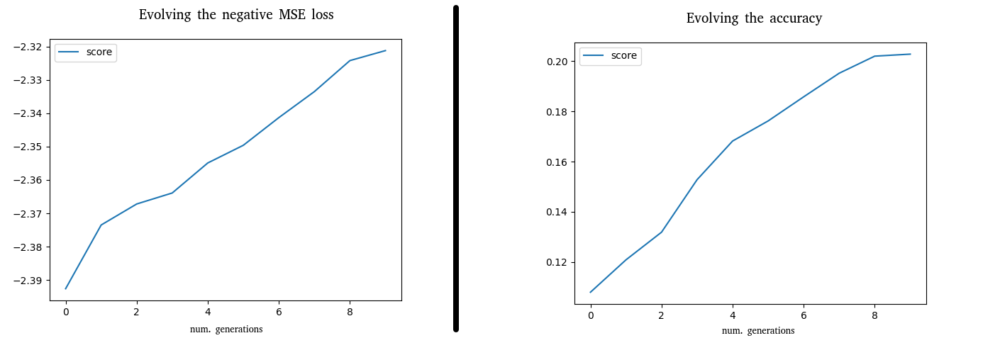

DEEPEVOLUTION
#############

.. image:: https://badge.fury.io/py/deepevolution.svg
    :target: https://badge.fury.io/py/deepevolution
.. image:: https://travis-ci.org/ipazc/deepevolution.svg?branch=master
    :target: https://travis-ci.org/ipazc/deepevolution

Implementation of a evolution algorithm for tensorflow keras models. It allows to evolve a keras neural network model for tasks where no differentiable loss functions are possible.

INSTALLATION
############

It can be installed through pip:

.. code:: bash

    $ pip install deepevolution

It requires tensorflow > 2.0.0. It can be installed as follows:

.. code:: bash

    $ pip install deepevolution[tf]
    # or
    $ pip install deepevolution[tf_gpu]

USAGE
#####

Import the package after you import the keras model class. The `deepevolution` package automatically binds the `fit_evolve()` method to the keras model class, making it instantly available to any keras model. Its usage is as simple as follows:

.. code:: python

    from tensorflow.keras.models import Model
    from deepevolution import wrap_keras

    wrap_keras()

    ## ... Build a keras model `model`...

    keras_model.fit_evolve(x_train, y_train, max_generations=100)

The default fitness function is the negative loss function of the model (must be compiled). For different fitnesses
functions, check the ADVANCED section.

EXAMPLE WITH MNIST
##################

Two examples can be found for the MNIST with the same feed-forward neural network in the folder `examples/`
In one, the negative MSE loss is used as fitness function (the default behaviour). In the other, the accuracy metric
is used for evolving the network.

UNDER-THE-HOOD
##############

What is going on when evolve is invoked?  The evolution process is made up of the following steps:

  1. Network's weights are duplicated to build a population of N networks (16 by default). Each individual network is differentiated by adding noise sampled from a normal distribution (with a std=0.3 by default) for each weight.

  2. Weights are evaluated by passing them to the fitness function along with the training data. This fitness function measures how well the network's weights perform with the given data, and it is totally customizable. More information about crafting a fitness function can be obtained in the ADVANCED section. If not provided, it will use by default a fitness function where the score of the network is measured by its negative loss (using the training data as evaluation).

  3. Elitism is practiced: the `top_k` (by default 4) models are selected for reproduction from the population, the rest are discarded.

  4. The crossover happens between pairs of top models. Each model's weights are crossed with subsequents models until all combinations are met. The crossover consists of merging the 50% of the weights from one model with the 50% of the other, plus a random mutation sampled from a normal distribution applied to a % of the weights (by default, 20%).

  5. The generated models after the crossover are mixed with the `top_k` from the previous generation. The result is a new generation that can be evolved again by jumping to the point 2.

ADVANCED
########

The following parameters can be set for an evolution:

 * max_generations: the number of generations that we will wait for. Similar to "epochs" concept. By default it is 100.
 * population: the number of individuals that will form the population of the generation. The higher, the better chances to find a new best-performing individual, but more computer resources are required. By default 16
 * top_k: the number of models that will survive the generation (based on its ranking score). They are considered to be the best K models of the generation.  By default it is 4
 * mutation_rate: percent of weights from the children to mutate on the new generation. By default it is 0.2 (20%).
 * mutation_std: the mutation is sampled from a normal distribution with a given std. By default it is 0.03. Higher values implies heavier mutations to the weights.
 * verbose: 0 for disabling logging, 1 for traditional logging of progress as messages, 2 for a tqdm bar.
 * fitness_func: the function for scoring each model.

A fitness function have the following prototype:

.. code:: python

    def fitness_func(model, X, Y):
        # Evaluate the model somehow. Note that it is optional to use X and Y.
        # This is the default behaviour, but any score can be returned
        result = model.evaluate(X, Y, batch_size=2048)[0]
        return -1 * result

One of the key benefits of this evolution algorithm is that the fitness function does not need to be a differentiable loss function. It can be any function that returns how well the model is working for a given task or scenario, making it suitable for reinforcement learning problems. The returned number must be a float, and the higher, the better performing.

